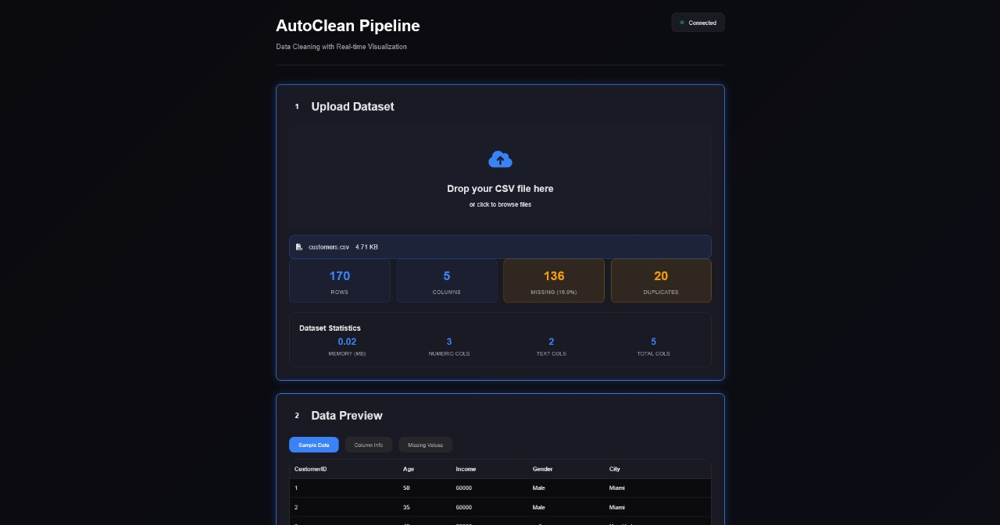
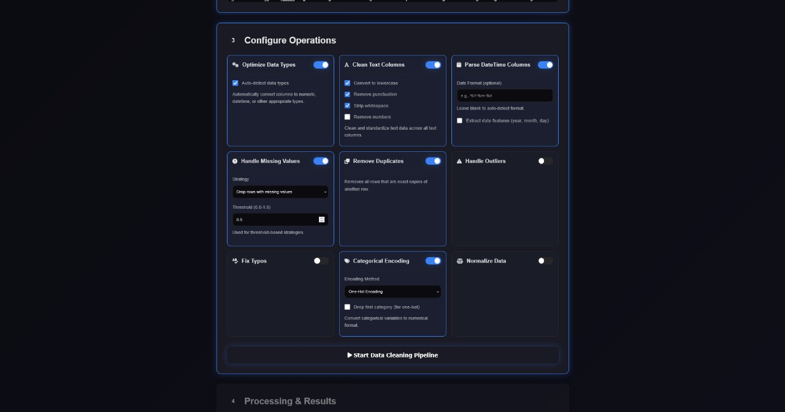
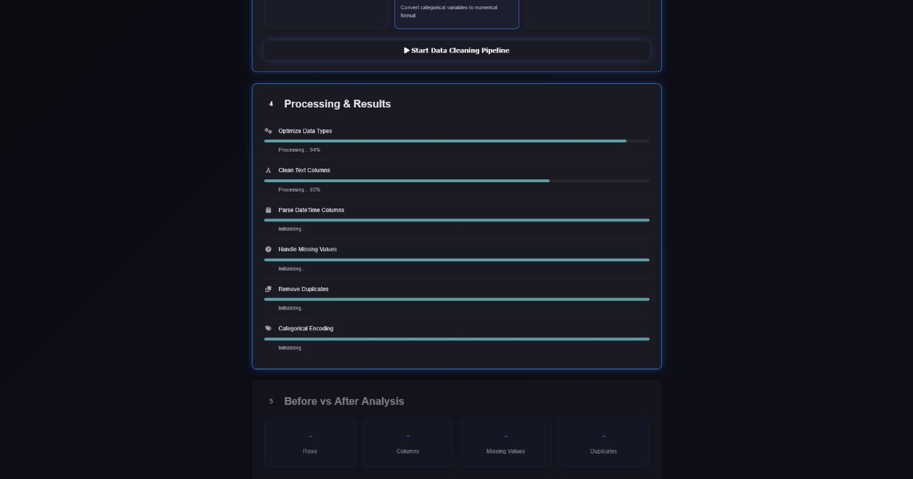
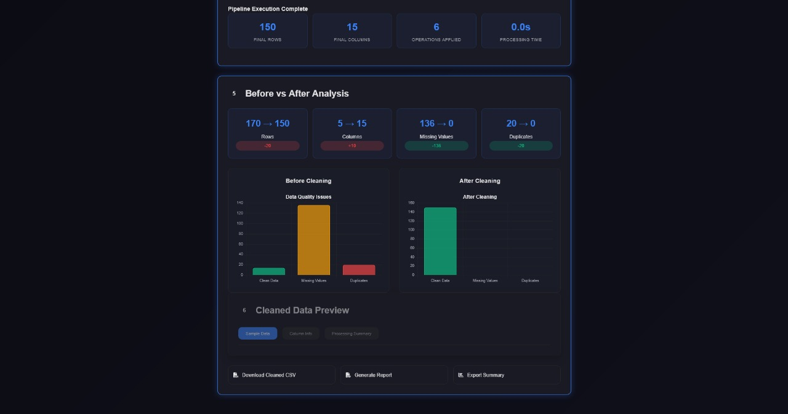

# 🧹 Automated Data Cleaning

A hackathon project that provides a simple pipeline for **cleaning messy CSV datasets**.  
Users can upload their data, and our system will automatically:

- 🔍 Detect and fix typos
- 🏷️ Normalize inconsistent labels
- 🧩 Handle missing values
- 📥 Generate a cleaned CSV ready for use

---

## 🚀 Tech Stack

### 🔹 Backend

- **Flask (Python)** – REST API framework
- **Pandas** – Data processing & cleaning

### 🔹 Frontend

- **HTML, CSS, JavaScript** – Simple user interface
- **Fetch API** – Communicating with backend APIs

---

## 📌 Key Features

- ✅ **Fully automated cleaning pipeline** – Upload and get cleaned data instantly
- ✅ **CSV upload support** – Works directly with user-provided datasets
- ✅ **Lightweight frontend** – Simple UI built with HTML, CSS, and JavaScript
- ✅ **Robust backend** – Powered by Flask & Pandas for reliable data processing

---

## 📸 Screenshots

### Hero Page

---

### Configuration Options

---

### Cleaning Process

---

### Cleaning Summary

---

## 🛠️ Contributions

- **Bilal Rukundi** – Team Lead, Backend architecture & Flask APIs
- **Mit Mer** – Frontend (HTML, CSS, JS)
- **Mohit Shukla** – Presentation and ML architecture
- **Vedant Pardeshi** – Documentation & Testing

---
